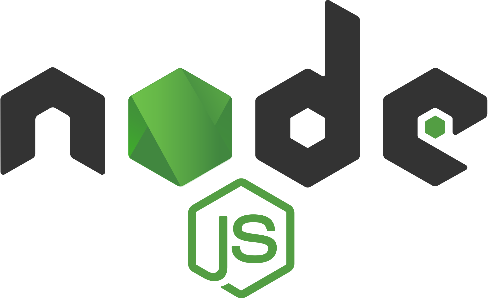

# Hi 👋🏼 I'm Nas 

        
I'm a Software Engineer 
 

## Languages & Tools

    
    
    
    
    
    
    
    
    
    
    
    
    
    
    
    
    
    
    
    

## Let's Connect

 
    

